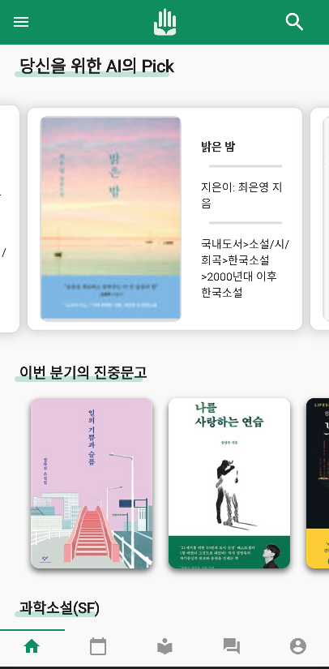
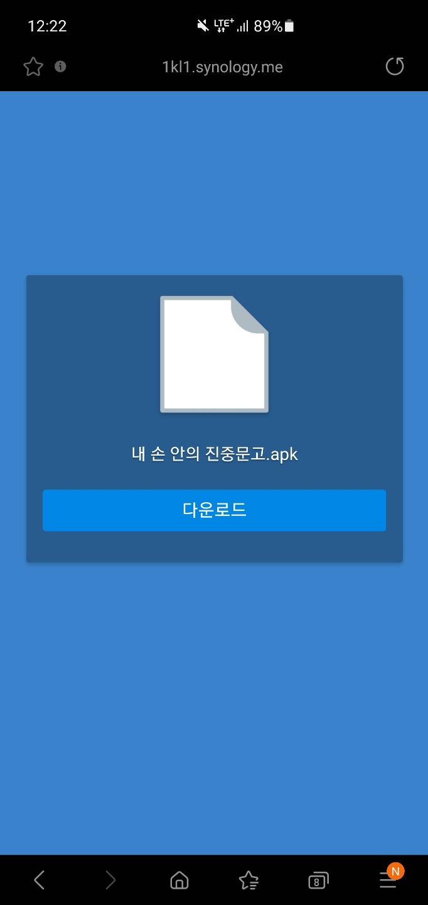
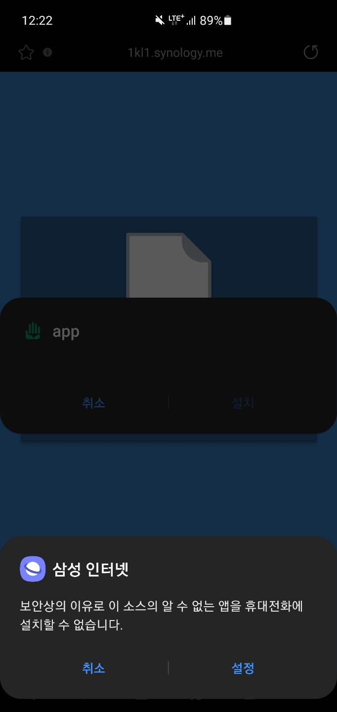
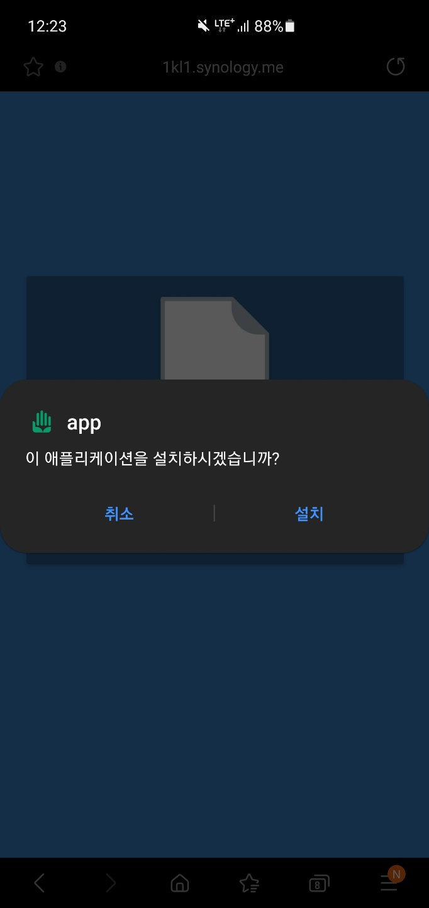
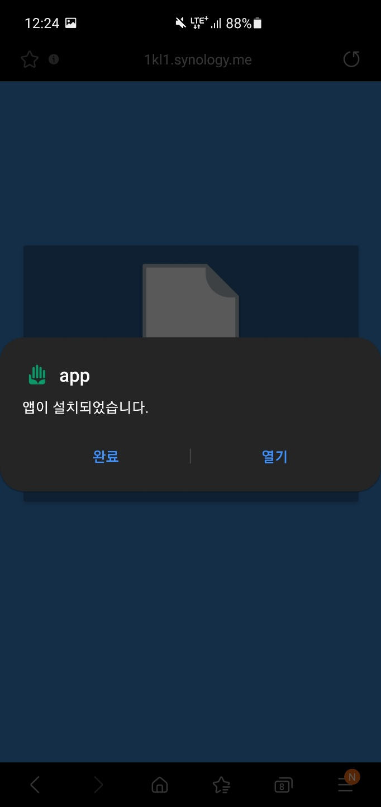
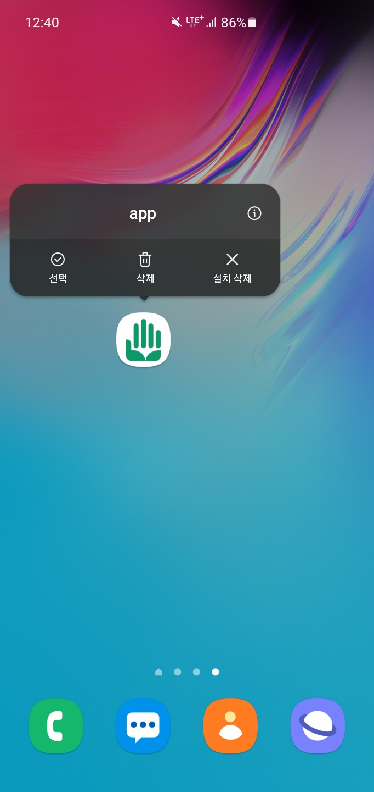

<!-- PROJECT LOGO -->
 

  

  <h3 align="center">내 손 안의 진중문고, HandyLib</h3>

  

    진중문고를 내 손안으로!
     
    <a href="https://humdrum-anise-0dc.notion.site/DevLib-0960a793aa544b2bbc3038d309ad2c47"><strong>[ 개발문서 보기 ]</strong></a>
    <a href="https://hyejin-degreeshow.site/"><strong>[ Demo 보기 ]</strong></a>
  

<!-- TABLE OF CONTENTS -->

<!-- ABOUT THE PROJECT -->

### 개요

프론트엔드에서는 flutter를 이용하여 앱 UI/UX 및 개인화 기능을 개발하였습니다. 

  
# UI/UX

## 플로우차트
  

## 메인페이지

메인 페이지는 총 다섯 개의 탭으로 구성되어 있습니다. 탭 구성은 아래와 같습니다.
<ol>
  <li><a href = "#ebookLib">전자 도서관</a></li>
  <li><a href = "#myBook">나의 서재</a></li>
  <li><a href = "#unitLib">부대 도서관</a></li>
  <li><a href = "#board">게시판</a></li>
  <li><a href = "#myPage">마이페이지</a></li>
 </ol>
 

  
### 📕 전자도서관

 &nbsp;&nbsp;&nbsp;&nbsp;&nbsp;&nbsp;&nbsp;&nbsp;&nbsp;&nbsp;&nbsp;&nbsp;&nbsp;&nbsp;&nbsp;&nbsp;&nbsp;&nbsp;&nbsp;&nbsp;

 
전자도서관은 산발적으로 나뉘어 있던 기존의 군 전자도서관 시스템을 <strong>하나로 통합한 시스템</strong>입니다. 
  
이 페이지에서는 다음 기능들을 지원합니다:
   
<ul>
  <li><strong>당신을 위한 AI의 Pick</strong> 사용자가 좋아요를 누른 책을 AI가 분석하여 사용자가 좋아할 만한 책을 추천합니다.</li> 
  <li><strong>이번 분기의 진중문고</strong> 각 분기마다 새로 보급된 진중문고를 ebook으로 만나볼 수 있도록 해 줍니다.</li> 
  <li><strong>장르 별 도서</strong> 장르 별로 사용자가 다양한 책을 접근할 수 있도록 뷰어를 제공합니다.</li> 
</li>

 
목록의 책을 누르면 책의 상세 정보를 볼 수 있습니다. 

  

 
이 페이지에서 책을 대출하거나, 좋아요를 누를 수 있습니다.
  
대출한 책은 <a href = "#myBook">나의 서재</a>에서 확인할 수 있습니다.
  
<strong>좋아요를 누른 책은 AI가 사용자의 취향을 분석하는 데 반영</strong>됩니다.
    
  
  

  
### 📗 나의 서재
 
나의 서재는 다음 기능들로 구성되어 있습니다 : 
  
<ul>
  <li><b>나의 취향 분석</b> 내가 고른 책들의 취향을 워드클라우드로 보여줍니다.</li> 
  <li><b>대출한 도서</b> 내가 대출한 도서들의 목록을 보여줍니다. 전자책으로 열람이 가능합니다.</li> 
 </ul>

 

  (열람 사진)

    
### 📘 부대 도서관

부대 도서관은 우리 부대의 도서관에 있는 실제 책들을 관리/이용할 수 있도록 하는 시스템입니다.
  
우리 부대에 새로 들어온 책들, 우리 부대의 인기 도서들, 우리 부대의 전체 책들을 열람할 수 있습니다.
  
이 데이터들은 부대 별로 따로 관리됩니다.
  
만약 우리 부대에 있는 책들이 ebook 데이터가 존재한다면 ebook도 열람할 수 있습니다.
  

&nbsp;&nbsp;&nbsp;&nbsp;&nbsp;&nbsp;&nbsp;&nbsp;&nbsp;&nbsp;&nbsp;&nbsp;&nbsp;&nbsp;&nbsp;&nbsp;&nbsp;&nbsp;&nbsp;&nbsp;
  
&nbsp;&nbsp;&nbsp;&nbsp;&nbsp;&nbsp;&nbsp;&nbsp;&nbsp;&nbsp;&nbsp;&nbsp;&nbsp;&nbsp;&nbsp;&nbsp;&nbsp;&nbsp;&nbsp;&nbsp;

  
### 📙 게시판

게시판은 총 세 개의 기능으로 나누어집니다.
  
<ul>
  <li><b>대회 개최 게시판</b> 장병들의 독서를 장려하기 위한 각종 대회를 개최하는 게시판입니다.</li>
  <li><b>독서 토론 게시판</b> 장병들이 독서 후 자유롭게 독서토론을 할 수 있는 게시판입니다.</li>
  <li><b>자유 게시판</b> 특정한 주제에 얽매이지 않고 자유롭게 이야기를 나눌 수 있는 게시판입니다.</li>
</ul>

&nbsp;&nbsp;&nbsp;&nbsp;&nbsp;&nbsp;&nbsp;&nbsp;&nbsp;&nbsp;&nbsp;&nbsp;&nbsp;&nbsp;&nbsp;&nbsp;&nbsp;&nbsp;&nbsp;&nbsp;
  
&nbsp;&nbsp;&nbsp;&nbsp;&nbsp;&nbsp;&nbsp;&nbsp;&nbsp;&nbsp;&nbsp;&nbsp;&nbsp;&nbsp;&nbsp;&nbsp;&nbsp;&nbsp;&nbsp;&nbsp;
  

  
### 📒 마이페이지

내 개인정보를 수정하는 기능을 제공합니다.
  
  &nbsp;&nbsp;&nbsp;&nbsp;&nbsp;&nbsp;&nbsp;&nbsp;&nbsp;&nbsp;&nbsp;&nbsp;&nbsp;&nbsp;&nbsp;&nbsp;&nbsp;&nbsp;&nbsp;&nbsp;
  

### 기타 페이지

&nbsp;&nbsp;&nbsp;&nbsp;&nbsp;&nbsp;&nbsp;&nbsp;&nbsp;&nbsp;&nbsp;&nbsp;&nbsp;&nbsp;&nbsp;&nbsp;&nbsp;&nbsp;&nbsp;&nbsp;
  

개인화된 추천 시스템을 제공하기 위한 회원가입과 로그인 기능을 제공합니다.
  

# 설치방법

## 요구사항
* 안드로이드 Api 21(Lollipop) 이상의 안드로이드 휴대폰
* 100mb이상의 저장공간
* 3mbps 이상급 인터넷 연결속도(원활한 사용을 위함)

## 설치

1. 다음 링크에 들어가주세요. [http://gofile.me/6KI41/irzDBPvjK](http://gofile.me/6KI41/irzDBPvjK)
2. 이하 설명에 따라서 어플리케이션을 설치해 주세요. 

설치법
1. 사이트 접속 후 다운로드 버튼을 눌러 다운로드해주세요.   2. 다운로드 받은 파일을 클릭하여 설치를 진행해주세요.    3. 보안상 문제가 생기면 설정 버튼을 누르고 [이 출처 허용]을 해주세요.    4. 이후 정상적으로 설치를 진행해주세요.   5. Play프로텍트 관련 문제가 나오면 무시하고 설치를 눌러서 설치를 마무리해주세요.    

3. 어플리케이션의 권한을 설정해 주세요. 

설정법
1. 어플리케이션을 2-3초간 꾹 눌러서 설정창을 연 후, 우측 상단의 i를 눌러주세요.   2. 권한을 클릭해주세요.    3. 저장공간, 카메라를 각각 클릭하여 권한을 허용해주세요.  

## 사용법

[시연 영상](https://www.youtube.com/watch?v=l0aqgu-mOxE)을 참고해주세요.

# 데이터 모델
## 객체 구조

### User
|객체명|type|의미|
|-|-|-|
|name|String|이름|
|userId|String|아이디|
|password|String|비밀번호|
|email|String|이메일|
|unit|String|소속 부대|
|rank|String|계급|

### Book
전자책 객체
|객체명|type|의미|
|-|-|-|
|title|String|도서명|
|author|String|작가|
|pubDate|String|출판일자|
|coverUrl|String|표지 url|
|isbn|String|isbn10|
|publisher|String|출판사|
|category|String|카테고리|

### Post
게시글 객체
|객체명|type|의미|
|-|-|-|
|postId|int?|게시글 번호|
|postName|String?|제목|
|postTag|String?|태그|
|author|String?|작성자|
|content|String?|내용|
|timestamp|String?|작성 시각|
|postCommentList|List\<Comment\>|댓글 리스트|

### Board
게시판 객체
|객체명|type|의미|
|-|-|-|
|boardId|int?|게시판 번호|
|boardName|String?|게시판 이름|
|boardTag|String?|게시판 태그|

### Comment
댓글 객체
|객체명|type|의미|
|-|-|-|
|content|String?|댓글 내용|
|author|String?|작성자|
|timestamp|String?|작성 시간|

### Unitbook
부대 내 도서 객체
|객체명|type|의미|
|-|-|-|
|title|String|도서명|
|author|String|작가|
|pubDate|String|출판일자|
|coverUrl|String|표지 url|
|isbn|String|isbn10|
|publisher|String|출판사|
|category|String|카테고리|

### Primary color 정의
본 프로그램에서는 두 개의 메인 색을 사용하고 있습니다.

R 224 G 240 B 227

R 184 G 216 B 190

R 12 G 152 B 105

## 라이센스
이 프로그램은 MIT 라이센스를 적용합니다.

## 한계와 발전방향
본 프로그램은 짧은 시간 내에 제작된 것으로 기본적인 기능 제공에 중점을 두고 있습니다.
  
전자책 시스템은 Aladin API에서 파싱해온 정보를 이용하는데, Aladin API는 책의 제목, 설명, isbn과 같은 일부 정보만 제공하고
  
전자책 db는 제공하고 있지 않습니다. 따라서 이 프로그램에서는 전자책을 실제로 열람할 수 없습니다.
  
만약 실제로 이 프로그램이 사용된다면 기존의 각 군 도서관 전자책 시스템 db를 가져와서 장병들이 열람할 수 있도록 수정할 필요가 있습니다.
  

## 개발자 정보
|개발자명|제작 분야|Contact|Page|
|-|-|-|-|
|홍지환|로그인, 회원가입, 부대 도서관, 게시판, 나의 프로필|eat333@naver.com|https://github.com/Jordano-Jackson|
|김민준|UI/UX 디자인, 전자도서관, 책 대출, 검색기능, 전자책|mamy0320@naver.com|https://github.com/1kl1|
