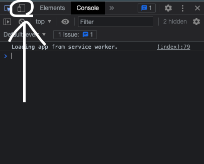
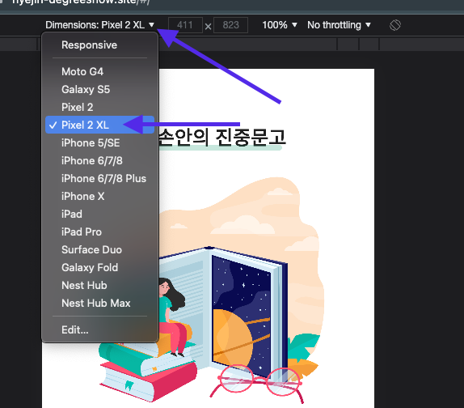
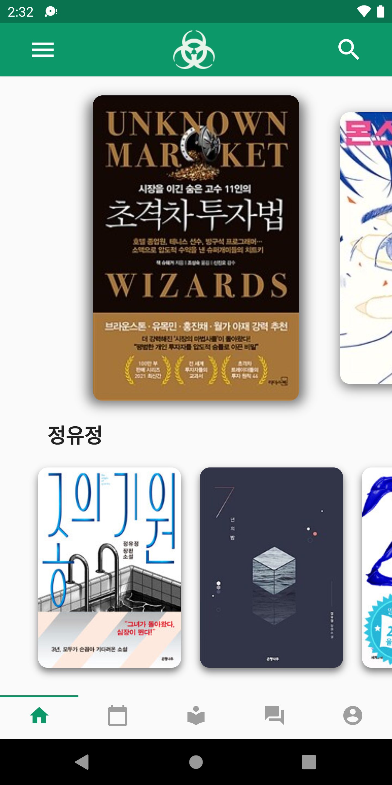
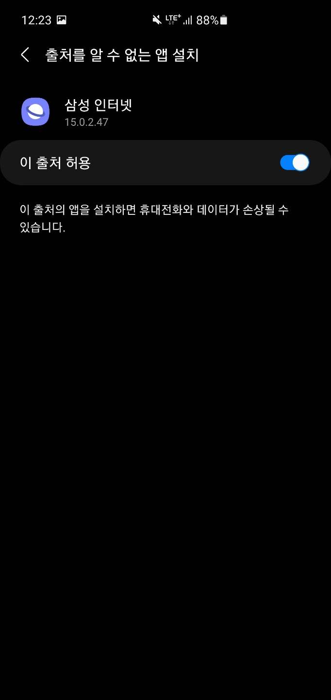
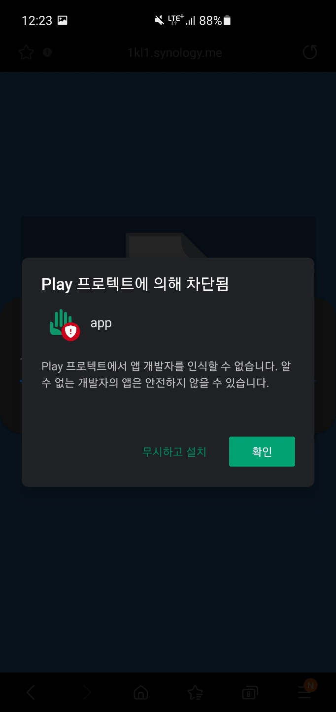
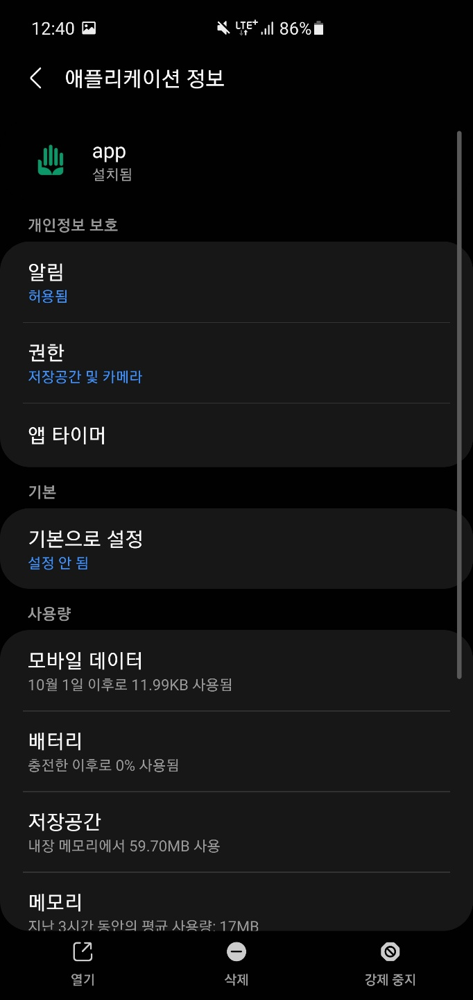
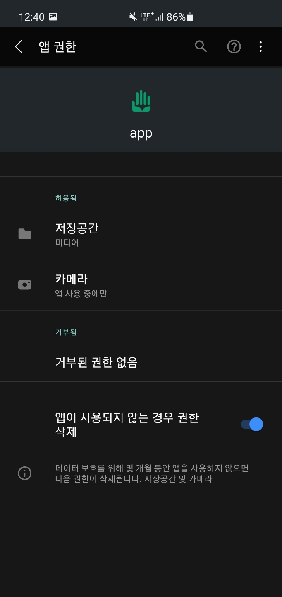
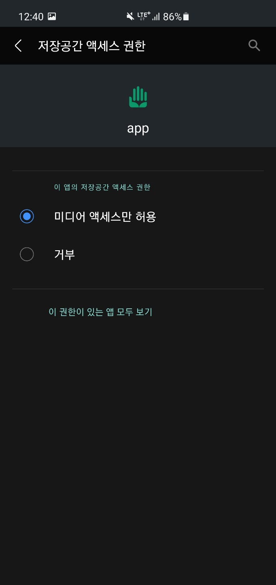
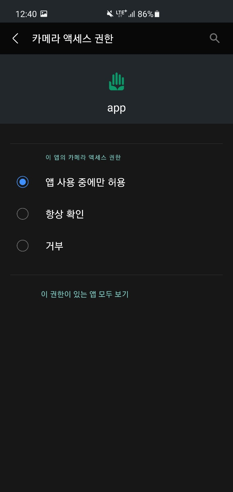

## 이하 프로젝트의 실행은 10월 27일(수)까지 유효합니다.

국방오픈소스아카데미에서 지원해주는 개발 환경의 사정 상 평일, 주말 및 공휴일은 09-23시까지 실행이 가능합니다. 이외 시간에 대한 실행은 보장할 수 없습니다. 군 복무중이라는 실정과, 담당자의 사정에 따라 실행에 지장이 있을 수 있는점 너그러이 양해 바랍니다.
[관련링크](https://osam.kr/hackathon/main)

<!-- PROJECT LOGO -->
 

  

  <h3 align="center">내 손 안의 진중문고, HandyLib</h3>

  

    진중문고를 내 손안으로!
     
    <a target="_blank" href="https://humdrum-anise-0dc.notion.site/DevLib-0960a793aa544b2bbc3038d309ad2c47"><strong>[ 개발문서 보기 ]</strong></a>
     
    <a target="_blank" href="https://hyejin-degreeshow.site"><strong>[ 데모버전 ]</strong></a>

데모버전 사용법

1. 상단의 링크를 통해 사이트에 접속해주세요. 
2. F12를 눌러 개발자도구를 활성화해주세요. 
3. 개발자도구의 좌측 상단에 있는 휴대폰 모양을 클릭해주세요 
  
4. 이후 화면상단에 있는 Dimensions를 Pixel 2XL로 변경해주세요. 
  
5. 이후 F5를 눌러 화면을 재로딩 해주시면 개발진이 의도한 어플리케이션 화면을 사용하실 수 있습니다!

  

<!-- TABLE OF CONTENTS -->

## Readme 목차

  <ol>
    <li>
      <a href="#프로젝트-요약">프로젝트 요약</a>
      <ul>
        <li><a href="https://github.com/osamhack2021/AI_APP_handylib_devlib/blob/main/README.md#--%EA%B0%9C%EB%B0%9C-%EB%8F%84%EA%B5%AC">개발 도구</a></li>
      </ul>
    </li>
    <li>
      <a href="#분야별-설명요약">분야별 설명요약</a>
      <ul>
        <li><a href="https://github.com/osamhack2021/AI_APP_handylib_devlib/blob/main/README.md#--%ED%94%84%EB%A1%A0%ED%8A%B8%EC%97%94%EB%93%9C">프론트엔드(flutter)</a></li>
        <li><a href="https://github.com/osamhack2021/AI_APP_handylib_devlib/blob/main/README.md#--%EB%B0%B1%EC%97%94%EB%93%9C">백엔드(flask)</a></li>
        <li><a href="https://github.com/osamhack2021/AI_APP_handylib_devlib/blob/main/README.md#--%EC%B6%94%EC%B2%9C%EC%95%8C%EA%B3%A0%EB%A6%AC%EC%A6%98">AI(추천알고리즘)</a></li>
      </ul>
    </li>
    <li><a href="#사용법">사용법</a></li>
    <ul>
        <li><a href="#설치">설치</a></li>
        <li><a href="#어플리케이션-사용법">어플리케이션 사용법</a></li>
      </ul>
    <li><a href="#라이센스">라이센스</a></li>
    <li><a href="#개발자-정보">개발자 정보</a></li>
  </ol>

<!-- ABOUT THE PROJECT -->
 

## 프로젝트 요약

 
'내 손안의 진중문고'는 진중(陣中)에 위치한 손 안의 도서관이라는 뜻으로, 현재 각 군부대에 위치한 북카페/도서관을 현역 군인들이 보다 손쉽게 사용할 수 있도록 어플리케이션으로 만들어졌습니다.

'내 손안의 진중문고'는 다음과 같은 장점이 있습니다:

- **인공지능 추천 알고리즘을** 통한 **도서 추천**으로 사용자의 독서를 장려할 수 있습니다. **_(이제 무슨 책을 읽을지 고민하지 않아도 됩니다.)_**
- **Ebook** Reader 기능을 지원합니다. **_(수만권의 책을 내 손 안으로!)_**
- 부대의 북카페/도서관에 있는 도서들의 **추적&관리**가 용이합니다. **_(이제 북카페 관리병이 필요 없어집니다.)_**
- 사용자는 부대 도서관의 도서 현황을 **열람**하고 원하는 도서를 **검색**할 수 있습니다.**_(이제 원하는 책이 있는지 방황할 필요가 없습니다.)_**

이상의 특장점은 각 군마다 존재한 기존의 전자책 도서관의 단점과 부대별로 상이한 북카페 관리 체계의 단점을 보완하고 장병 복지와 자기계발에 큰 기여를 하고 있는 진중문고의 외부유출 및 유통 문제를 해결하고 양질의 도서를 보다 좋은 접근성으로 제공하여 줍니다.

### - 개발 도구

- [python](https://www.python.org/)
- [flutter](https://flutter-ko.dev/)
- [flask](https://flask.palletsprojects.com/en/2.0.x/)
  
<!-- GETTING STARTED -->

## 분야별 설명요약

---

### - 프론트엔드

크로스 플랫폼 SDK인 flutter을 이용하여 어플리케이션을 개발하였습니다. 로그인/회원가입 기능으로 어플리케이션을 개인화였고, 도서 추천, 나의 서재, 부대 도서관, 게시판, 개인정보 수정 기능을 가지고 있습니다. 
자세한 내용은 이하의 앱의 [Readme](https://github.com/osamhack2021/AI_APP_handylib_devlib/tree/main/APP(FE))를 참고해주세요.

---

### - 백엔드

Python의 웹 프레임워크 중 하나인 Flask를 이용하여 어플리케이션의 요청을 처리하는 REST API를 개발하였습니다. 어플리케이션에 정보 저장에 필요한 데이터베이스는 Mongodb를 이용하였고 apache를 이용하여 서버를 자동화하였습니다. 
자세한 내용은 이하의 백엔드의 [Readme](<https://github.com/osamhack2021/AI_APP_handylib_devlib/blob/main/App(BE)>)를 참고해주세요.

---

### - 추천알고리즘

collaborative filtering 중 하나인 matrix factorization을 이용하여 추천시스템을 개발하였습니다. 신규사용자에겐 도서 이용 기록등이 없으므로 전체 책 중 무작위로 추천리스트가 제공되고, 사용자가 좋아하는 도서에 좋아요를 누르면 매일 밤 21시 추천점수가 업데이트되어 맞춤형 도서를 추천받을 수 있습니다. 
자세한 내용은 AI의 [Readme](https://github.com/osamhack2021/AI_APP_handylib_devlib/tree/main/AI)를 참고해주세요.

 

## 사용법

사용자는 안드로이드/ios 스마트폰을 이용하여 어플리케이션을 설치하여 기능을 사용할 수 있습니다. Demo버전은 web을 제공중에 있습니다. 현재는 ios 빌드가 유료인 관계로 안드로이드만을 지원하며, 추후 ios빌드를 제공할 계획입니다.

### 설치

1. 다음 링크에 들어가주세요. [http://gofile.me/6KI41/irzDBPvjK](http://gofile.me/6KI41/irzDBPvjK)
2. 이하 설명에 따라서 어플리케이션을 설치해 주세요. 

설치법
1. 사이트 접속 후 다운로드 버튼을 눌러 다운로드해주세요.   2. 다운로드 받은 파일을 클릭하여 설치를 진행해주세요.    3. 보안상 문제가 생기면 설정 버튼을 누르고 [이 출처 허용]을 해주세요.    4. 이후 정상적으로 설치를 진행해주세요.   5. Play프로텍트 관련 문제가 나오면 무시하고 설치를 눌러서 설치를 마무리해주세요.    

3. 어플리케이션의 권한을 설정해 주세요. 

설정법
1. 어플리케이션을 2-3초간 꾹 눌러서 설정창을 연 후, 우측 상단의 i를 눌러주세요.   2. 권한을 클릭해주세요.    3. 저장공간, 카메라를 각각 클릭하여 권한을 허용해주세요.  

각 기능별 개발을 위한 설치방법은 기능별 README를 참고해주세요.

<!-- USAGE EXAMPLES -->

### 어플리케이션 사용법

[시연 영상](https://www.youtube.com/watch?v=l0aqgu-mOxE)을 참고해주세요.

<!-- LICENSE -->

## 라이센스

MIT라이센스가 적용되었습니다. [`LICENSE`](https://github.com/osamhack2021/AI_APP_handylib_devlib/blob/main/LICENSE) 파일을 통해 확인할 수 있습니다. 프로젝트에 사용된 오픈소스 라이브러리에 대한 라이센스는 [`DEPENDENCIES`](https://github.com/osamhack2021/AI_APP_handylib_devlib/blob/main/DEPENDENCIES) 파일을 통해 확인해주세요.

<!-- CONTACT -->

## 개발자 정보

김민준 
홍지환 - eat333@naver.com  
김수민 - kdg97811@naver.com 
고명진 - mj2000go@naver.com 
김승하 - kstream35@gmail.com 

군장병 온라인 해커톤: [https://osam.kr/home](https://osam.kr/home)
